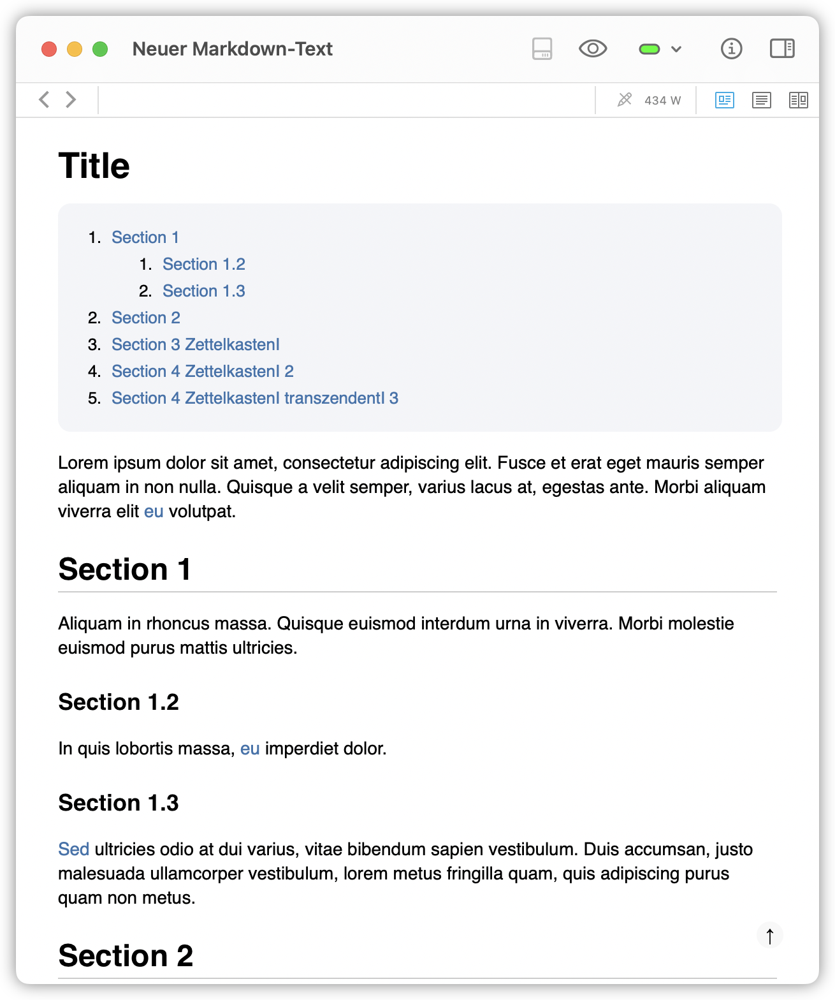
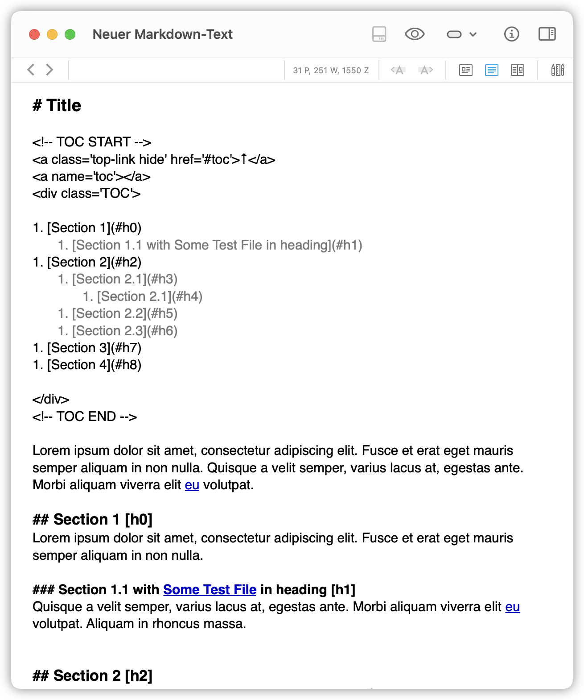
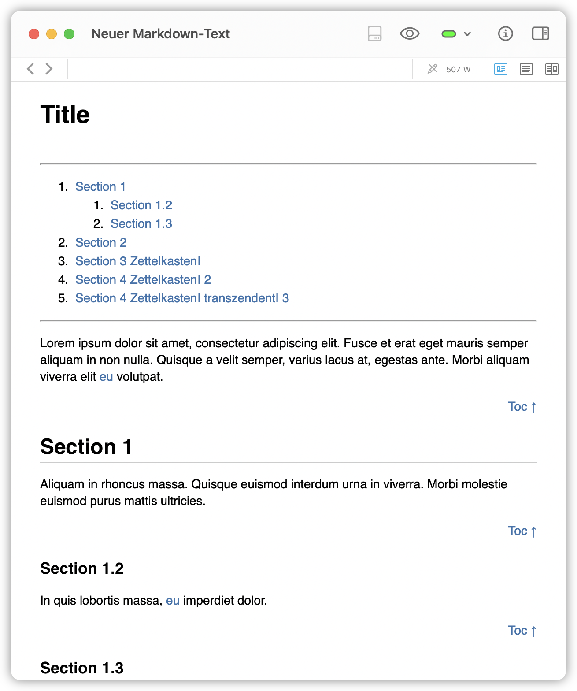
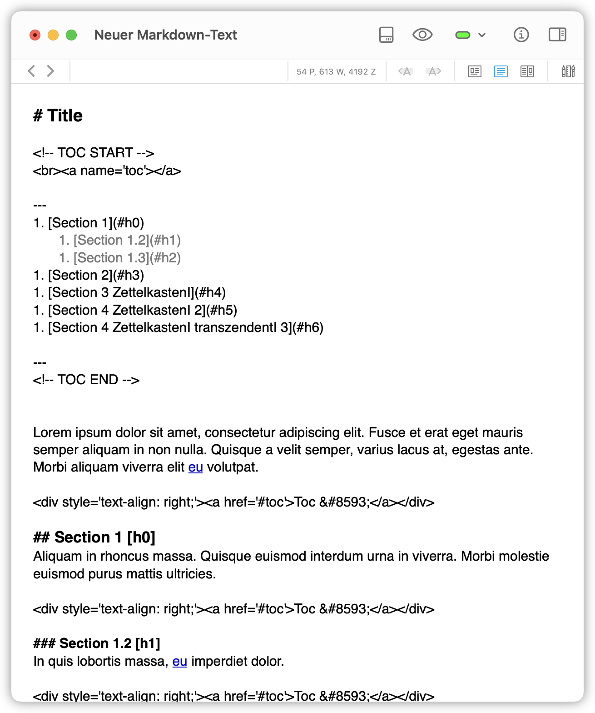

# DEVONthink Markdown TOC generator

This AppleScript generates a table of contents (TOC) and adds a floating back-to-top button in DEVONthink's Markdown documents.

<p align="center"  style="text-align: center;">
<a href="Screenshots/Screenshot_preview_new.png"></a>
<a href="Screenshots/Screenshot_editview_new.png"></a>

The generated TOC and the floating Back-to-top button in DEVONthink's Markdown preview (top) and edit (bottom) view. 
</p> 

## How to install
Download the two AppleScript and Python files:

* TOC generate.applescript
* TOC remove.applescript
* generate_toc.py
* remove_toc.py

Place the AppleScript files into DEVONthink's script folder.

<p align="center" style="text-align: center;">
<a href="Screenshots/Screenshot_DEVONthink_script_folder.png"></a>

Open DEVONthink's script folder via DEVONthink's script menu.
</p> 

Place the Python scripts into a folder of your choice. The path to the folder containing the Python scripts must be specified in the `MyPythonScriptPath` variable within the AppleScripts. 

The AppleScripts rely on these Python scripts, which work for both Python 2 and 3. On macOS <12.3, set the `LocalPython` variable in the AppleScript to "/usr/bin/python". For higher macOS versions, install Python (e.g., via [Anaconda.com](https://www.anaconda.com) or [python.org](https://www.python.org/downloads/)), find out the path of the Python installation (open a terminal and type "which python") and set `LocalPython` to the given result. 


To make the floating Back-to-toc button work, please add the followong CSS commands to your Markdown style sheet file:

```css
@media screen and (prefers-reduced-motion: no-preference) {
  html {
    scroll-behavior: smooth;
  }
}

.top-link {
  transition:       all .25s ease-in-out;
  position:         fixed;
  bottom:           0;
  right:            0;
  display:          inline-flex;
  color:            #000000;

  cursor:           pointer;
  align-items:      center;
  justify-content:  center;
  margin:           0 2em 2em 0;
  border-radius:    50%;
  padding:          .25em;
  width:            1em;
  height:           1em;
  background-color: #F8F8F8;
}
```

The CSS commands for the TOC layout are:

```css
.TOC {
    background:     #f4f5f8 none repeat scroll 0 0; //f3f6f6
    border:         0px solid #aaa;
    border-radius:  10px;
    display:        table;
    font-size:      95%;
    margin-bottom:  1em;
    padding-left:   2px;
    padding-top:    2px;
    padding-bottom: 2px;
    padding-right:  2px;
    width:          100%;
}

.TOC li, .TOC ul, .TOC ul li{
    list-style:     decimal;
}

/*Uncomment to add a title to your TOC:*/
/*.TOC:before {
    content:        "Table of Contents";
    font-weight:    bold;
    font-size:      1.1em;
    color:          #3973ad;
    padding-left:   1em;
    margin-bottom: -1em;
    line-height:    3em;
}*/
```

You can also find my full CSS file [here](https://github.com/FabrizioMusacchio/GitHub_Flavor_Markdown_CSS).

To make the floating Back-to-toc button work in DEVONthink To Go (DTTG) as well, please [add the CSS commands from above into the CSS field of DTTG](https://github.com/FabrizioMusacchio/GitHub_Flavor_Markdown_CSS#floating-back-to-top-button-in-devonthink-to-go).


## How the script works
The AppleScript hands-over the document's content to the Python script, which scans for all lines starting with a `#`, collects the heading texts and adds a label at the end of each headline (e.g., `## Section 1 [h0]`). The labels – not visible in the preview mode – are required for a simple but unambiguous linking to the headlines and are automatically updated with each run of the script. In the [version with Back-to-toc links](#version-with-back-to-toc-links), a Back-to-toc link is placed over each headline, which links to the TOC. 

The script also scans for an existing TOC. If available, that TOC is updated and its previous position in the document is retained. I.e., after the first run of the script, a TOC section (`<!-- TOC START -->...<!-- TOC END -->`) is inserted right after the first line of the document. You can freely move that section within the document.

In the Python script, you can define the TOC-level to be considered by adjusting the `toc_level` variable:

```
toc_level defines at which toc-level to start, e.g.:
  2 - only account for headings h2 (##) and higher; requires that
      the first occuring heading is h2 (except the document
      heading in line 0 (headline_index))
  1 - account for headings h1 (#) and higher; requires that a
      the first occuring heading is h1 (except the document
      heading in line 0 (headline_index))
```

By default, the script ignores the first line of the document, so that the document's title will not be part of the TOC. 

The script respects a so-called reference
links section (`<!-- LINKS START -->...<!-- LINKS END -->?`, if available). This section is the result of another AppleScript I apply for handling Markdown reference links.

When the Python script is done, the original content including the TOC and all other additions is handed-over back to the AppleScript, which replaces the document's current content with the updated one.

The "TOC remove" script removes the generated TOC, the added headline labels and the Back-to-toc links (if available).

## Version with Back-to-toc links
The version 

* TOC generate with btt-links.applescript

differs from the one above in such a away, that it adds Back-to-toc links above each headline instead of the floating back-to-toc button. It also does not require any additional CSS commands. 

<p align="center" style="text-align: center;">
<a href="Screenshots/Screenshot_preview.png"></a>
<a href="Screenshots/Screenshot_editview.png"></a>

The generated TOC with Back-to-toc links in DEVONthink's Markdown preview (top) and edit (bottom). 
</p>


## Use at your own risk
I checked all scripts for various possible formatting within a Markdown document and I tried to make them as failure-resistant as possible. Nevertheless, the scripts replace your document's content with an actually new version of the content, which contains the additions mentioned above. In extreme cases, formatting that have not yet been taken into account can cause the scripts to delete parts of the content or even the entire content. **Therefore, please backup your files before you apply the scripts and first try them out with some Markdown files, that contain some formatting that you usually apply to your documents**. Please report any bugs in the issue section.
